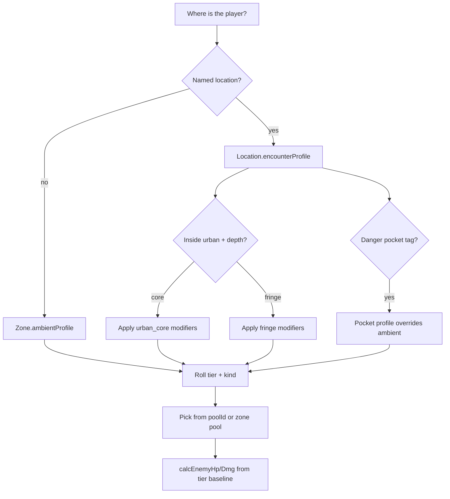

# Enemy tier scaling — places, ambient danger, and pockets

| Field | Value |
|-------|-------|
| **Status** | `designed` |
| **Blocked on** | Location encounter profiles on `WORLD_LOCATIONS`; field-site pools ([`explore-field-gathering.md`](explore-field-gathering.md)) |
| **Issue** | none yet |
| **Chat / PR** | Design pass 2026-10-08 · prototype zone bands [#147](https://github.com/WanderingImmortal/tales-immortal-path/pull/147) (to be superseded) |
| **Updated** | 2026-10-08 (Redwell street QC bands) |

## Intent

Combat threat should read **locally**, like xianxia travel: the **city** feels like its station; **just outside the walls** is rougher; the **open zone** has a dull ambient risk; **named bad spots** (ruins, nests, deep quarry levels) spike into real danger. Cultivation progress lets you **stomp** places below your tier — not because enemies secretly scaled to your Qi Density, but because you walked back into a tier-0 scrub with a tier-2 core.

**Whole zones (e.g. “Dustbone = tier 0–1”) are too coarse.** Dustbone contains Redwell’s alleys, Dewcatch’s edge, Ironscar’s deep pit, and Threshold’s streets — different worlds.

Cross-links: [`city-tiers.md`](city-tiers.md) (civic ladder) · [`redwell-starter-city.md`](redwell-starter-city.md) · [`explore-field-gathering.md`](explore-field-gathering.md) · [`dustbone-living-board.md`](dustbone-living-board.md) · [`realm-claims.md`](realm-claims.md) (pressure when you throw weight around).

---

## Core concepts

### 1. Combat tier (unchanged axis)

Numeric **tier 0–6** ≈ player `realmIdx` / standard realm names. Used for **HP/dmg baselines** and sense readouts.

Optional later: **sub-band** within a tier (early QC vs late QC) as `tier + fraction` or separate `threatBand` — not required for v2 if pools are place-specific.

### 2. Civic tier ≠ street combat tier

| Layer | Meaning | Example (Redwell) |
|-------|---------|-------------------|
| **Civic tier** | Apex deterrence, politics, “who runs the city” | 4th-tier city — lord ~ mid–late FE ([`city-tiers.md`](city-tiers.md)) |
| **Street anchor** | Average random trouble **in town** | ~tier **0** (QC brawls, petty cultivators, drunk mercenaries) |
| **Street ceiling** | Rare “someone serious is in town” | tier **1** event, not tier 4 |

Players should **not** meet the city lord’s realm in a random alley fight. Law, arrays, and face keep apex predators off the street — or they appear only as **scripted** arcs.

### 3. Place encounter profile (the unit of design)

Every **`WORLD_LOCATIONS`** entry (and later travel edges) gets an **`encounterProfile`** — not one band per continent zone.

Suggested fields (design names):

| Field | Role |
|-------|------|
| `anchorTier` | Center of random tier roll (integer or half-step) |
| `spread` | How far rolls deviate (e.g. ±0 → ±1) |
| `tierMin` / `tierMax` | Hard clamp |
| `kindWeights` | `{ human, beast, spirit, … }` — sum to 1 |
| `poolId` | Optional dedicated template pool (see field sites) |
| `rateMult` | Encounter frequency vs baseline (city low, deep cave high) |
| `tags` | `urban_core`, `urban_fringe`, `field`, `route`, `pocket`, … |

**Roll (conceptual):**  
`tier = clamp(anchorTier + weightedRoll(spread), tierMin, tierMax)` → pick template from `poolId` (or zone fallback) matching `tier` + `kind`.

Stats still come from **tier baselines × template shape**, not player farm stats (see [#147](https://github.com/WanderingImmortal/tales-immortal-path/pull/147) direction).

### 4. Ambient stratum ( “everywhere else” )

When the player is **in the zone** but not in a named place (or on a generic explore/travel hook):

- Use the zone’s **`ambientProfile`**: wide, boring band — e.g. Dustbone ambient **0–1**, skew low.
- Weaker than **pockets**, milder than **city cores** (less law, more beasts).
- This is the “rough danger level of the sands,” not Redwell’s alleys.

Zones keep **`dangerRealm`** / guide text for **“above your station”** warnings; ambient profile is the mechanical default for shapeless wilderness.

### 5. Danger pockets

**Named hotspots** (or procedural tiles later) that **override** ambient:

- Explicit **`encounterProfile`** with higher `anchorTier`, tighter `kindWeights` (beast nest, corrupted ruin, bandit salient).
- Often tied to map nodes, subzones, or “go deeper” in field sites ([`explore-field-gathering.md`](explore-field-gathering.md): Safe → Wild → Deadly).
- May **only** spawn one tier band (`tierMin === tierMax`) for identity (“this scrub tops at QC; the pit is FE beasts”).

Pockets are how you get **granularity without splitting the whole zone**: most of Dustbone is ambient 0–1; Ironscar deep is pocket **1–2**; a sealed ancient gate is pocket **2** fixed.

### 6. Urban vs fringe vs field

| Place type | Typical anchor | Kind bias | Encounter rate |
|------------|----------------|-----------|----------------|
| **Urban core** | city `streetAnchor` | **human-only (v1)** — see Redwell | low |
| **Urban fringe** (outside walls, night roads) | anchor + 0..1 | human-first; beasts on field routes later | medium |
| **Field site (edge)** | site safe band | site pool | medium |
| **Field site (deep)** | site wild/deadly | site pool + elites | higher |
| **Route** | interpolate endpoints or min(ambient) | mixed | low–medium |
| **Pocket** | profile override | thematic | high |

---

## Resolution flow (design — no code yet)



**Activities** may pass context: `explore`, `travel`, `job_escort`, `depth: wild` — modifiers on spread or pool, not player stats.

**Scripted fights** (encounters, bosses, tribulation) **pin** tier or raw HP; they skip the roll.

---

## Dustbone worked example (target feel)

Civic context: Redwell **4th-tier** city; Threshold **1st-tier** capital ([`city-tiers.md`](city-tiers.md)). Combat below is **street / field**, not apex lords.

| Place | Profile type | anchor | min–max | Notes |
|-------|----------------|--------|---------|--------|
| **Redwell** (market, inn, seats) | urban_core | 0 | 0–0* | **Human-only** street brawl — QC band table below |
| **Redwell fringe** (well road at night) | urban_fringe | 0 | 0–0* | Human robbers/outers; still no random FE |
| **Dewcatch Scrub** edge | field safe | 0 | 0–0 | Site pool: viper, stalker ([`explore-field-gathering.md`](explore-field-gathering.md)) |
| **Dewcatch** deep | field wild | 0.5 | 0–1 | Elite: Dew-Catch Wight (pinned tier) |
| **Ironscar Quarry** shallow | field safe/wild | 0 | 0–1 | Claim-jumpers, lizards |
| **Ironscar** deep | pocket deadly | 1 | 1–1 | Pit Brute; commons cap below elite |
| **Bonehollow** | field + depth | 0 → 1 | 0–2 by depth | Deadly pocket at bottom |
| **Road Redwell ↔ Threshold** | route | 0 | 0–1 | Ambient; optional bandit **pocket** along path |
| **Threshold City** core | urban_core | 1 | 1–2 | Stronger than Redwell; still not “capital lord” tier |
| **Open desert** (no location) | ambient | 0 | 0–1 | Generic beasts / corrupted wanderers, skew low |

**Invincibility moment:** Core Formation cultivator in Dewcatch edge should **one-shot** tier-0 commons and see **fewer** rolls (`rateMult`), not inflated HP.

\* Redwell urban **tierMax = 0** (still in Qi Condensation) until we add FE **scripted** content — not “0–1” with Foundation randos in alleys.

---

## Redwell — street brawl (reference slice)

**Pilot city** for place-first profiles. Aligns with QC bands in [`qc-depth.js`](../../qc-depth.js) (`early` / `mid` / `late` / `peak`) and civic tone in [`redwell-starter-city.md`](redwell-starter-city.md).

### Kind lock (for now)

- **Redwell urban_core + urban_fringe:** `kindWeights = { human: 1 }`.
- **Beasts in cities** (beast cities, pets, escaped mounts) — **parked**; fields/ambient/pockets stay where beasts belong.
- Dewcatch / Ironscar / open desert keep beast pools when those profiles ship.

### Social ladder → who you fight in a random street brawl

In a **4th-tier** town whose **civic apex** is mid–late FE, the **street** is still a QC pond. Power looks like **recognition**, not HP inflation:

| QC stage | Redwell social read | In random street brawl pool? | Weight (target) | Combat note |
|----------|---------------------|------------------------------|-----------------|-------------|
| **Early** | Nobody; fair game | Yes | **~40%** | Weakest QC baseline within tier 0 |
| **Mid** | Locals, interchangeable | Yes | **~40%** | Standard tier-0 baseline |
| **Late** | Names at the tavern; people think twice | Yes, uncommon | **~15%** | Slightly tougher tier-0 stat band |
| **Peak** | Known and **respected**; room made | Rare | **~5%** | Top tier-0 band; often needs provocation flag later |
| **Foundation+** | **People of importance** — power in town | **No** (random) | **0%** | Master Liang, lord, seat-holders: NPCs, jobs, tournament, grudges — not explore fodder |

**Foundation Establishment and above** in Redwell are not “alley trash.” Early FE like Well-Ring Master Liang is **scripted weight** (sense lines already in `qc-depth.js`), not a `pickEnemyTemplate` roll.

### Profile sketch (`redwell` location)

```yaml
encounterProfile:
  tags: [urban_core]
  kindWeights: { human: 1 }
  realmCap: 0                    # Qi Condensation only for random street
  qcStageWeights:                # only when tier 0
    early: 40
    mid: 40
    late: 15
    peak: 5
  rateMult: 0.6                  # lower than scrub — fights are social, not constant
  poolId: redwell_street_humans  # dedicated names: drunk outer, gambler, pamphlet thief, …
```

**Fringe** (`redwell_fringe` or same node + `urban_fringe` tag): same human QC table; slightly higher `rateMult`; still **no FE** randoms.

### Player mirror → **public dossier**

Redwell QC weights describe **attackers**. Whether you’re attacked at all — and whether the pool includes “nobodies” vs “peak rivals” — comes from **`getPlayerKnownRealmBand()` / `getPlayerKnownQcStage()`** and **respect** math, not raw `G.qcBand` alone.

Full mesh: [`public-strength-encounter-selection.md`](public-strength-encounter-selection.md).

### What stays scripted

| Content | Tier / stage | Channel |
|---------|----------------|---------|
| Well-Ring registration beef | QC–early FE | job / NPC |
| Yearly promotion tournament | QC peaks | event |
| City Lord / seat holders | mid–late FE | sense, audience, chronicle |
| Field elites (Wight, Pit Brute) | pinned | place pocket, not street |

### Open (Redwell-only)

- Peak QC random 5%: keep or move entirely to **grudge / duel accept**?
- One “disrespectful outsider” FE template for **Threshold visitors** in market — scripted only?
- When player is **FE**, is Redwell random combat **off** entirely in core?

---

## Enemy taxonomy (pools)

Keep global **`ENEMIES`** as templates (`tier`, `kind`, shape stats).

Add **`ENCOUNTER_POOLS`** (or per-location lists):

- `dustbone_dewcatch_commons`, `dustbone_quarry_commons`, …
- Zone-wide **`ENEMIES`** remain fallback for unnamed wilderness.

**Kinds:**

| kind | Tier label (UI) | Typical places |
|------|-----------------|----------------|
| `human` | Cultivator of realm X | cities, roads, bandits |
| `beast` | N-order demon beast | fields, jungles, pockets |
| `spirit` | Ghost / remnant | caves, tribulation adjacency, ruins |

Same numeric tier; future: separate baseline tables per kind if beasts should be punchier at same “grade.”

---

## What supersedes zone-only bands

Prototype [#147](https://github.com/WanderingImmortal/tales-immortal-path/pull/147) uses `ZONES.encounterTierMin/Max` only. **Target architecture:**

1. **`resolveEncounterProfile(locationId, zoneId, activity, opts)`** → profile  
2. Location profiles **win** over zone ambient.  
3. Zone bands become **fallback** when `locationId` is null.  
4. Map / travel UI shows **predictable** band (field triangle already wants this).

Do **not** merge civic tier integer into combat tier without a **`streetAnchor`** indirection.

---

## Player power & pacing (locked direction)

- **Do not** scale random HP/dmg from Qi Density, techniques, or max HP.  
- **Do** scale **how scary the place is** via place tables.  
- Optional: if `playerTier >= placeMax + 2`, reduce encounter rate or auto-resolve fodder — feel-only, later.  
- **Crucible / trials** may keep player-linked scaling (endurance tests) — separate `context`.

Combat **ATB tempo** should eventually key off **tier baseline**, not post-scaling dmg ([#147](https://github.com/WanderingImmortal/tales-immortal-path/pull/147) follow-up).

---

## Prerequisites (build order)

- [ ] Schema for `encounterProfile` on `WORLD_LOCATIONS` + `ambientProfile` on `ZONES`  
- [ ] `resolveEncounterProfile` + swap `pickEnemyTemplate` to use it  
- [ ] Dustbone v1 content: Redwell, three field sites, routes, Threshold stub  
- [ ] Align elites/bosses to pinned tiers in field doc  
- [ ] UI: local map / explore confirm shows threat band  
- [ ] Deprecate zone-only min/max as primary (keep fallback)

---

## Open questions

1. **Travel encounters:** roll from **origin**, **destination**, **route table**, or worst-of?  
2. **Sub-tier granularity:** do we need QC early/late split before adding tier 1, or are place pools enough?  
3. **City beasts:** parked — beast cities / pets later; Redwell v1 **human-only**.  
4. **Dynamic pockets:** faction war / chronicle raises `anchorTier` for a node temporarily?  
5. **Hidden subzones** ([`ancients.js`](../../ancients.js) pattern): inherit parent ambient or own pocket profile?  
6. **PR [#147](https://github.com/WanderingImmortal/tales-immortal-path/pull/147):** merge as interim fallback, or hold until location profiles land?

---

## Implementation crumbs (future)

- `WORLD_LOCATIONS`, `ZONES` — `data.js` / `world.js`  
- `pickEnemyTemplate`, `calcEnemyHp` — `combat.js`  
- Field depth: explore actions pass `depth` / `band`  
- [`explore-field-gathering.md`](explore-field-gathering.md) enemy pools → first real `poolId` consumers  
- Civic display: [`city-tiers.md`](city-tiers.md) vs combat tooltip (“Typical trouble: QC”)
